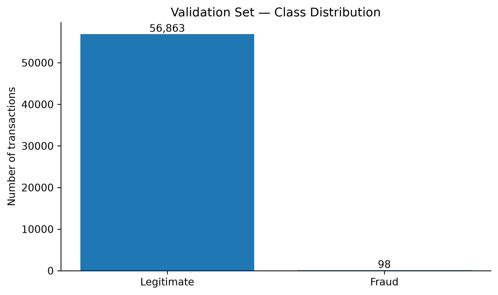
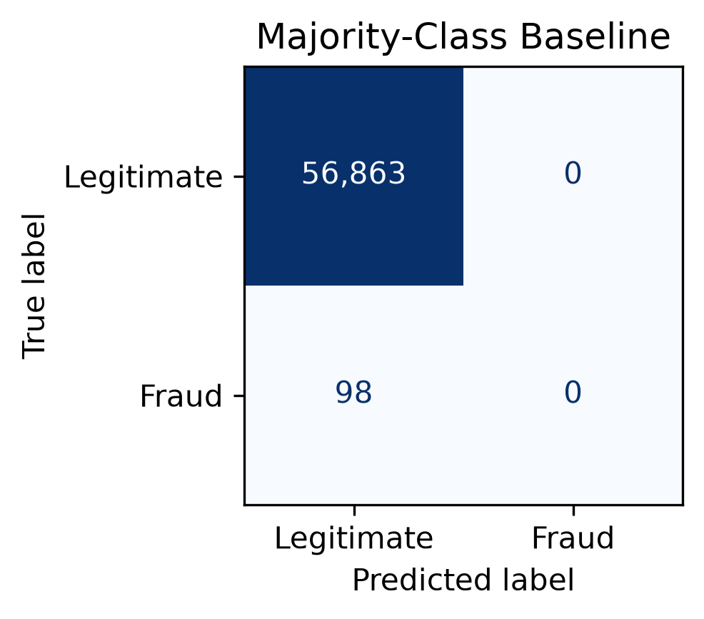

# Fraud Detection: Establishing a Meaningful Baseline

**An Engineering Perspective on Imbalanced Classification**

## Abstract

Fraud detection is commonly formulated as a binary classification problem. However, the extreme imbalance between legitimate and fraudulent transactions makes conventional performance measures potentially misleading.

This work establishes a deliberately simple baseline before considering more sophisticated predictive approaches. The objective at this stage is not to maximize predictive performance, but to determine whether the evaluation framework can distinguish meaningful fraud-detection capability from a trivial classifier.

Using a transaction dataset with a highly asymmetric class distribution, we demonstrate how a classifier can achieve apparently excellent accuracy while providing no fraud-detection capability.

The result establishes a fundamental constraint for the investigation: **performance must be interpreted in the context of the event being detected, rather than through aggregate accuracy alone.**

    

**Figure 1** — Class distribution in the validation set. Fraudulent transactions represent only a small fraction of the evaluated population, creating a highly imbalanced classification problem.

---

## 1. Problem

Automated fraud detection requires identifying transactions that present characteristics associated with fraudulent behavior while allowing legitimate transactions to proceed normally.

Although the problem can be represented as binary classification,

**legitimate → 0**  
**fraudulent → 1**

the classes are not equally represented.

In the validation set used in this study, there are **98 fraudulent transactions among approximately 56,934 transactions**, with the remaining approximately **56,836 transactions classified as legitimate**.

This corresponds to a fraud prevalence of approximately **0.17%**.

The asymmetry is fundamental to the engineering problem.

A classifier that predicts the majority class for every transaction can appear highly accurate while never identifying a single fraudulent transaction.

Therefore, the first question is not:

> _Which machine learning model performs best?_

It is:

> **What constitutes a meaningful reference for evaluating this problem?**

---

## 2. Baseline

Before considering predictive complexity, a trivial classifier provides a necessary reference.

The baseline considered in this study predicts every transaction as legitimate.

This classifier has no ability to detect fraud. Nevertheless, because legitimate transactions dominate the dataset, it obtains approximately **99.83% accuracy** on the validation population.

The result can be represented by the following confusion structure:

| |Predicted Legitimate|Predicted Fraud|
|---|--:|--:|
|**Actual Legitimate**|≈56,836|0|
|**Actual Fraud**|98|0|

The baseline therefore produces:

- **Accuracy:** ≈99.83%
    
- **Fraud Recall:** 0%
    
- **Fraud Precision:** undefined because no transaction is predicted as fraud
    
- **Fraud Detection:** none
    

The apparent contradiction is the central observation.

A value close to 100% accuracy does not indicate a useful fraud detector.

It primarily reflects the underlying class distribution.

    

**Figure 2** — Confusion matrix of the majority-class baseline. The classifier achieves high overall accuracy by predicting every transaction as legitimate, while detecting none of the fraudulent transactions.

---

## 3. Engineering Interpretation

The baseline establishes an important constraint on the interpretation of subsequent results.

When one class overwhelmingly dominates the population, aggregate accuracy can conceal complete failure on the minority class.

This means that the evaluation of a fraud-detection system cannot be separated from the characteristics of the event being detected.

The distinction is particularly important because classification errors are not equivalent.

A false negative represents a fraudulent transaction that was not identified.

A false positive represents a legitimate transaction incorrectly identified as suspicious.

These outcomes have different consequences and therefore cannot be adequately represented by a single aggregate measure.

The baseline consequently demonstrates that **the definition of performance is itself part of the engineering problem.**

This observation precedes any consideration of model sophistication.

---

## 4. The Significance of the Baseline

A baseline is sometimes treated as a formality: an elementary result included only to establish a number against which later models can be compared.

In a highly imbalanced problem, its role is more fundamental.

The baseline exposes whether the evaluation framework can distinguish between:

- performing well on the majority population; and
    
- accomplishing the actual detection objective.
    

In this study, the distinction is unambiguous.

The classifier obtains approximately **99.83% accuracy**, yet detects **0% of the fraudulent transactions**.

The result demonstrates that a metric can be numerically strong while being insufficiently informative for the engineering objective.

This is not a failure of the baseline.

It is precisely what the baseline is intended to reveal.

---

## 5. Result

The principal result of this study is:

> **99.83% accuracy can coexist with 0% fraud recall.**

The finding demonstrates that overall accuracy is not sufficient to characterize the effectiveness of a fraud-detection classifier under severe class imbalance.

More importantly, it establishes a reference against which claims of predictive improvement can be interpreted.

A subsequent approach cannot be considered meaningful merely because it produces a different or higher aggregate metric.

It must demonstrate evidence of capability on the problem of interest.

---

## 6. Engineering Implication

The baseline changes the nature of the problem.

The question is no longer simply whether a classifier can achieve high predictive performance.

The relevant question becomes whether the observed performance represents **actual information about fraudulent transactions** rather than an artifact of their rarity in the population.

This distinction has consequences beyond model selection.

It affects how experiments are interpreted, how competing approaches are compared and how predictive results should ultimately be related to an operational context.

The baseline therefore serves as a boundary condition for the investigation:

> **A fraud-detection system must be evaluated according to what it detects, not merely according to how often it is correct.**

---

## 7. Conclusion

A meaningful investigation of fraud detection should begin by establishing what a trivial solution can already achieve.

In the dataset examined here, the majority-class baseline reaches approximately **99.83% accuracy while detecting none of the fraudulent transactions**.

This result demonstrates the central difficulty of evaluating highly imbalanced classification problems: aggregate performance can obscure complete failure on the minority class.

The contribution of this study is therefore not a predictive model.

It is the establishment of a **meaningful reference and an evaluation constraint** for the investigation that follows.

Any claim of improvement must be interpreted against this reference and must demonstrate that the system has acquired information relevant to the minority event.

The baseline has therefore answered the first engineering question:

> **Can apparent classification performance be distinguished from meaningful fraud-detection capability?**

**Yes — and the distinction is essential.**

### Keywords

Fraud Detection · Machine Learning · Imbalanced Classification · Baseline · Classification Metrics · Model Evaluation · Engineering
