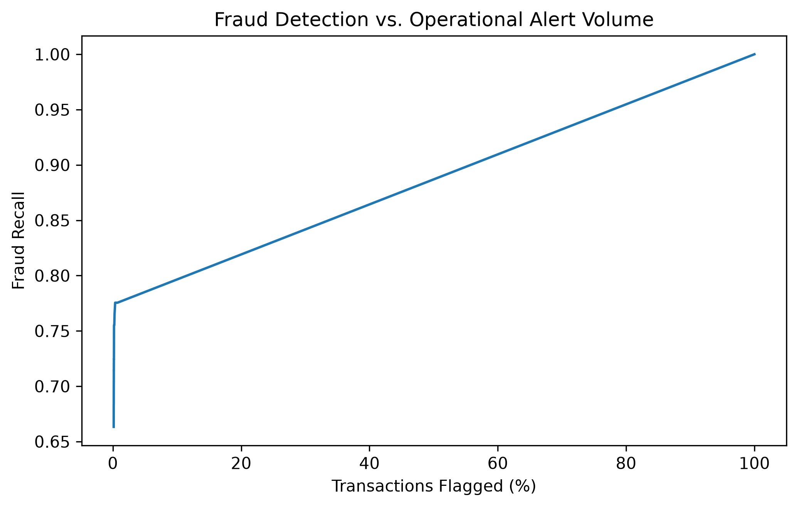

# From Prediction to Decision: Translating Fraud Risk into Operational Actions

### Abstract

Machine Learning models used in fraud detection do not directly determine business outcomes. They generate predictive information that must ultimately be interpreted within an operational context.

This Research Case investigates the relationship between predictive performance and the consequences of acting on model outputs in a highly imbalanced fraud-detection problem.

The analysis demonstrates that changes in the operating conditions of a predictive system can materially alter detection performance and the resulting intervention volume.

The findings reinforce a fundamental engineering distinction: **predictive performance and operational effectiveness are related, but they are not the same problem.**

---

## 1. Problem

Fraud detection is commonly represented as a binary classification problem:

```text
Transaction
     ↓
Machine Learning Model
     ↓
Fraud / Legitimate
```

This representation is useful, but it does not capture the complete engineering problem.

A predictive model produces information about the likelihood of an event. An operational system must subsequently determine how that information should be acted upon.

The distinction becomes particularly important in fraud detection because interventions have consequences.

Detecting additional fraudulent activity may require processing additional suspicious cases.

Reducing intervention may decrease operational burden while allowing more fraudulent activity to remain undetected.

The problem therefore extends beyond classification.

> **A predictive result becomes operationally meaningful only when its consequences are considered.**

---

## 2. Research Question

The investigation examines a fundamental question:

> **What changes when predictive fraud estimates are evaluated as inputs to an operational decision rather than as classification outputs alone?**

The objective is not to establish a universally optimal operating point.

Such a conclusion would require business information that is not contained in the public experimental dataset.

Instead, the objective is to establish whether changes in the operating conditions of the system produce materially different technical and operational outcomes.

---

## 3. Experimental Context

The analysis uses predictions generated within the fraud-detection investigation and evaluates their behavior under different decision conditions.

The analysis considers both predictive performance and the resulting population affected by the decision.

This distinction is important because two systems with similar predictive characteristics may produce substantially different operational consequences depending on how their outputs are used.

The experiment therefore evaluates the system from two complementary perspectives:

```text
Predictive Performance
          +
Operational Consequence
```

The analysis is performed on the validation population used throughout the investigation.

Specific implementation details and internal decision-selection procedures are intentionally outside the scope of this publication.

---

## 4. Results

The experiments demonstrate that the operating condition applied to model predictions materially changes the resulting behavior of the system.

The observed results show a clear trade-off between:

- the proportion of fraudulent transactions identified;
    
- the precision of the resulting alerts;
    
- the overall classification balance;
    
- the number of transactions subjected to intervention.
    

At one extreme, highly permissive decision conditions can maximize fraud detection while generating a very large intervention population.

At the other extreme, more selective conditions reduce the number of transactions subjected to intervention, while allowing a greater proportion of fraudulent transactions to remain unidentified.

The important result is therefore not a particular operating point.

It is the existence of a measurable relationship between **detection performance and operational intervention**.

<p align="center">
  
</p>

**Figure 1** — Predictive performance across different operating conditions. The observed variation demonstrates that the operating point materially influences the relationship between fraud detection and false-positive exposure.

<p align="center">
  
</p>

**Figure 2** — Relationship between operational intervention volume and fraud Recall. The results demonstrate that increased intervention and increased detection are related, but the relationship is not cost-free.

---

## 5. Prediction Is Not the Decision

The results expose an important distinction in the architecture of a fraud-detection system.

A model produces predictive information.

That information does not, by itself, determine the operational action.

The relationship can be represented at a high level as:

```text
Transaction
     ↓
Prediction
     ↓
Interpretation
     ↓
Decision
     ↓
Operational Consequence
```

The precise mechanisms used between these stages depend on the characteristics and constraints of the system.

The important engineering observation is that **the predictive layer and the decision layer should not be treated as interchangeable**.

A model can produce useful predictive information while the resulting operational policy remains unsuitable for a particular environment.

Conversely, a change in operational policy can materially alter system behavior without changing the underlying predictive model.

---

## 6. Operational Consequences

Every transaction selected for intervention potentially consumes operational resources.

Consequently, the number of transactions affected by a fraud-detection decision is not merely a secondary statistic.

It is an operational characteristic of the system.

The investigation demonstrates that this characteristic changes together with the system's detection behavior.

This creates an important engineering constraint:

> **Improving one dimension of fraud detection can change the workload imposed on the rest of the system.**

The predictive model cannot be evaluated independently from this consequence.

---

## 7. Asymmetric Consequences

Fraud detection contains at least two fundamentally different classes of error.

A false negative represents fraudulent activity that was not identified.

A false positive represents legitimate activity that was incorrectly subjected to intervention.

These events have different meanings and potentially different consequences.

Conceptually:

```text
                    Decision
                       │
             ┌─────────┴─────────┐
             ▼                   ▼
        False Negative      False Positive
             │                   │
             ▼                   ▼
      Fraud Exposure       Legitimate Impact
```

The public dataset does not provide sufficient information to assign reliable monetary values to these outcomes.

For this reason, the investigation does not introduce artificial financial assumptions in order to manufacture an economic optimum.

This is a deliberate methodological constraint.

---

## 8. Engineering Interpretation

The principal engineering finding is:

> **Fraud detection is not exclusively a predictive modeling problem.**

The predictive model is one component of a larger system.

Once predictions influence operational actions, the behavior of the decision layer becomes relevant to system performance.

This means that a technically strong predictive result cannot automatically be interpreted as a strong operational result.

The distinction can be summarized as:

```text
Model Capability
       ≠
Operational Effectiveness
```

The two are connected, but they answer different questions.

Predictive evaluation describes what the model can identify under a given evaluation condition.

Operational evaluation considers what happens when those predictions are used to drive actions.

---

## 9. Business Interpretation

The investigation does not identify a universally superior operating condition.

Instead, it establishes why such a conclusion cannot be derived from predictive metrics alone.

A real operating environment would need to provide additional information, external to the public benchmark.

Therefore, the technically observed trade-off can be demonstrated experimentally, while the final business decision remains dependent on the operating environment.

This distinction prevents an experimental result from being presented as an unsupported production recommendation.

---

## 10. What This Research Case Demonstrates

This Research Case establishes three conclusions.

### 1. Predictive outputs do not define operational outcomes

A model's prediction is an input to a decision process rather than the complete decision itself.

### 2. Operating conditions materially affect system behavior

Changes in how predictive outputs are interpreted can alter both detection performance and the population subjected to intervention.

### 3. The final operating point is context-dependent

Predictive metrics alone are insufficient to establish a universally optimal operating condition when the consequences of different errors are asymmetric.

These findings establish a distinction between **model evaluation** and **decision-system evaluation**.

---

## 11. Scope and Limitations

This Research Case uses a public fraud-detection dataset and therefore provides a controlled experimental environment rather than a complete representation of production fraud operations.

The analysis does not model the full set of factors that can influence a production decision system

The results should therefore be interpreted as evidence of the observed technical and operational relationship within the experimental environment.

They should not be interpreted as a production decision policy.

---

## Conclusion

The investigation demonstrates that the problem of fraud detection does not end when a Machine Learning model produces a prediction.

The behavior of the system depends on how that predictive information is subsequently used.

The experiments show that different operating conditions can materially change both fraud-detection performance and the volume of transactions subjected to intervention.

The central finding is therefore:

> **Prediction quality and decision quality are distinct dimensions of an engineered fraud-detection system.**

A predictive model can provide the information required for a decision, but determining whether that information should trigger intervention requires consideration of operational and business constraints that cannot be inferred from model metrics alone.

The significance of this distinction extends beyond the benchmark itself.

It establishes a boundary between evaluating a **Machine Learning model** and evaluating the **system in which that model operates**.

### Keywords

Fraud Detection · Machine Learning · Imbalanced Classification · Decision Systems · Model Evaluation · Operational Risk · Threshold Analysis · Business Decision-Making
